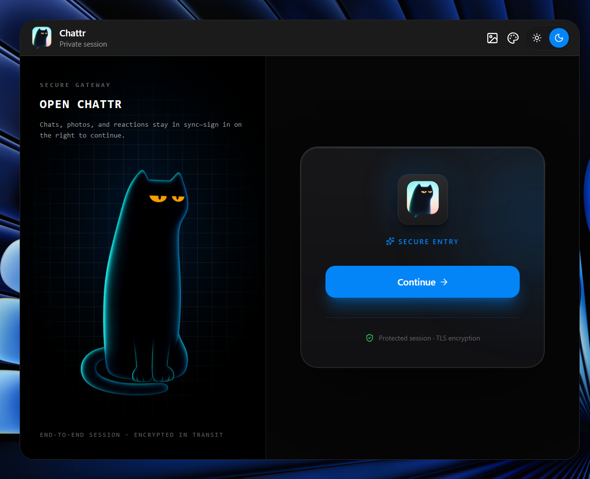

# 💬 Chattr

A modern, real-time chat application featuring rich messaging, theme presets, interactive wallpapers, and customizable keystroke sound effects.

  

---

## ✨ Features

- **⚡ Real-time Messaging**: Instant communication powered by Socket.io.
- **🔐 Secure Authentication**: Seamless auth flows handled via Clerk (React Clerk frontend & Express Clerk backend).
- **🖼️ Rich Media Sharing**: Support for uploading and sharing images and videos, handled by Multer and hosted/optimized via ImageKit.
- **🎨 Custom UI Theme Presets**: Choose between light/dark modes and custom presets (e.g., Sky, Spotify, etc.) powered by HeroUI.
- **⛺ Dynamic Wallpapers**: Customize chat frames with various high-quality wallpapers.
- **🔊 Keystroke Sound Effects**: Satisfying typewriter and mechanical keyboard sounds as you write, with toggle options.
- **🟢 Live Online Indicators**: Real-time status badges showing when users are active.

---

## 🛠️ Tech Stack

### Frontend
- **Framework**: React 19 + Vite
- **Styling**: Tailwind CSS v4 + HeroUI
- **State Management**: Zustand
- **Icons**: Lucide React
- **Real-time Connectivity**: Socket.io-client
- **Authentication**: `@clerk/react`

### Backend
- **Runtime**: Node.js
- **Framework**: Express v5
- **Real-time Server**: Socket.io
- **Database**: MongoDB (via Mongoose)
- **File Uploads**: Multer + `@imagekit/nodejs`
- **Authentication**: `@clerk/express`

---
